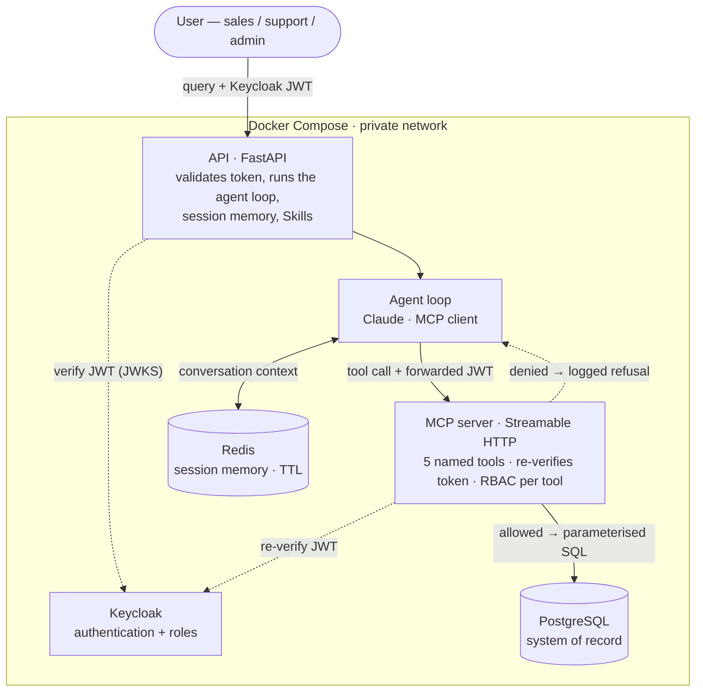

# Vantage

A grounded, **agentic** enterprise assistant for **Acme Operations** (a fictional B2B payments platform) — an internal copilot for sales, support, and operations staff that **retrieves, summarises, and recommends next actions** across customers and their support issues, **securely and auditably**. Built for the EY Applied AI Engineer technical assessment.

The agent reasons over a small set of **named, RBAC-checked tools** exposed by a **custom MCP server**, never raw SQL. Permissions are enforced in the tools (not the prompt), so even a fully prompt-injected agent can't exceed the caller's role. Answers are always grounded in the database — a missing customer is reported as "not found," near-identical names are disambiguated, never invented.

> Design rationale, ADRs, threat model, and the build log live in [`Vantage-vault/`](Vantage-vault/) — start at [`00-NOW.md`](Vantage-vault/00-NOW.md).

## Architecture



- **Agent** = a minimal Claude **tool-calling loop**, not a framework ([ADR-001](Vantage-vault/05-Decisions/ADR-001-agent-framework.md)); model-agnostic via `app/llm.py`.
- **MCP server** exposes the five named tools over Streamable HTTP ([ADR-003](Vantage-vault/05-Decisions/ADR-003-mcp-server.md)); the agent *discovers* and *calls* them — it never sees SQL and never holds DB credentials.
- **RBAC is enforced inside each tool**, on the Keycloak token **re-verified at the MCP boundary** ([ADR-002](Vantage-vault/05-Decisions/ADR-002-rbac-tool-boundary.md)) — never in the prompt.
- **Postgres** = system of record; **Redis** = ephemeral multi-turn session memory ([ADR-006](Vantage-vault/05-Decisions/ADR-006-memory-split.md)).

## The five tools
| Tool | Does | Roles |
|---|---|---|
| `get_customer_profile` | resolve a customer by name (found / ambiguous / not_found) | all |
| `get_open_issues` | a customer's open issues, most-urgent first | all |
| `summarise_issue_history` | an issue + its full audit trail | all |
| `update_issue` | add a note / change status (attributable) | support, admin |
| `create_next_action` / `update_next_action` | record/update a formal next action | admin |

A disallowed call writes nothing, returns a structured `denied`, and is **audit-logged**.

## Skills
Reusable, named capabilities (the Anthropic *Agent Skill* pattern, packaged here as JSON): instructions + parameters + an `allowed_tools` whitelist, run through the agent loop. A Skill is *just a prompt + a tool whitelist*, so it can never exceed the caller's permissions.
- Seeded: **Customer Escalation Summary** — risk level + rationale + recommended next action (advice) + missing info; read-only, persists nothing.
- Users can **author their own** by turning a finished session into a skill (`POST /skills/draft-from-session` → review → `POST /skills`).

## Run it (one command)
Requires Docker and an `ANTHROPIC_API_KEY`.
```bash
cp .env.example .env          # then set ANTHROPIC_API_KEY in .env
docker compose up --build     # db + redis + keycloak + mcp + api
```
Postgres loads `db/schema.sql` then `db/seed.sql` on first init. Check readiness: `curl localhost:8000/ready`.

### Chat UI
Open **<http://localhost:8000/>** in a browser. Single-page chat (Alpine.js + Tailwind Play CDN + markdown-it + DOMPurify) — sidebar of past chats, per-message tool-trace expander, Skills menu, "save as skill" affordance, dark/light themes. **PR foundation: backend is currently mocked client-side**; the next PR wires the real OIDC auth + streaming `/ask/stream` + `/sessions` + `/skills/*` endpoints documented below.

### Get a token + ask (dev)
```bash
TOKEN=$(curl -s http://localhost:8080/realms/vantage/protocol/openid-connect/token \
  -d grant_type=password -d client_id=vantage-api -d client_secret=vantage-secret \
  -d username=marcus.webb -d password=marcus | python3 -c 'import sys,json;print(json.load(sys.stdin)["access_token"])')

curl -s -X POST http://localhost:8000/ask -H "Authorization: Bearer $TOKEN" \
  -H 'Content-Type: application/json' \
  -d '{"query":"Show open issues for Velocity Marketplace, summarise the most urgent, and suggest a next action."}'
```
Dev users (persona names from the vault stories): `priya.nair`/`priya` (sales), `marcus.webb`/`marcus` (support), `dana.okafor`/`dana` (admin).

### Endpoints
- `POST /ask` `{query, session_id?}` — ask the agent; returns `{answer, trace, elapsed_ms, session_id}`. Reuse `session_id` for multi-turn.
- `GET /skills` · `POST /skills/{name}/run` `{params}` — list / invoke Skills.
- `POST /skills/draft-from-session` · `POST /skills` — author a Skill from a session, then save.
- `GET /whoami` · `GET /health` · `GET /ready`.

## Security
JWT fully verified (signature/issuer/expiry, `alg` pinned); RBAC at the tool boundary, re-verified by the MCP server; parameterised SQL only (no raw-SQL tool); audit logs record identifiers + actions, never tokens or PII. Threat model + dev→prod hardening: [`09-Security.md`](Vantage-vault/09-Security.md).

## Observability
Every `/ask` returns a `trace` of tool calls (input, result status, per-tool `ms`) + total `elapsed_ms`; write attempts emit a server-side **audit log** line (`user / roles / target / decision`); tool/agent errors surface as `502` with detail.

## Evaluation
10 runnable cases proving tool-selection, grounding (E1/E2/E3), RBAC (allow + deny), multi-turn memory, the Skill, and auth — see [`07-Evals.md`](Vantage-vault/07-Evals.md). Run against the live stack:
```bash
python eval/run_evals.py        # latest: 10/10 passed
```

## Repo layout
- `app/` — FastAPI API, agent loop (MCP client), session memory, Skills
- `mcp_server/` — the MCP server: the five tools, DB access, token re-verification
- `db/` — `schema.sql` + `seed.sql` (committed; generator in `scripts/`)
- `keycloak/` — realm config (roles + dev users)
- `eval/` — evaluation harness
- `Vantage-vault/` — design vault (ADRs, architecture, user stories, security, build log)

## AI-usage notes
This project was built with heavy AI assistance under human review; each delegated task and how it was validated is logged in [`06-Build-Log.md`](Vantage-vault/06-Build-Log.md#ai-usage-log).
