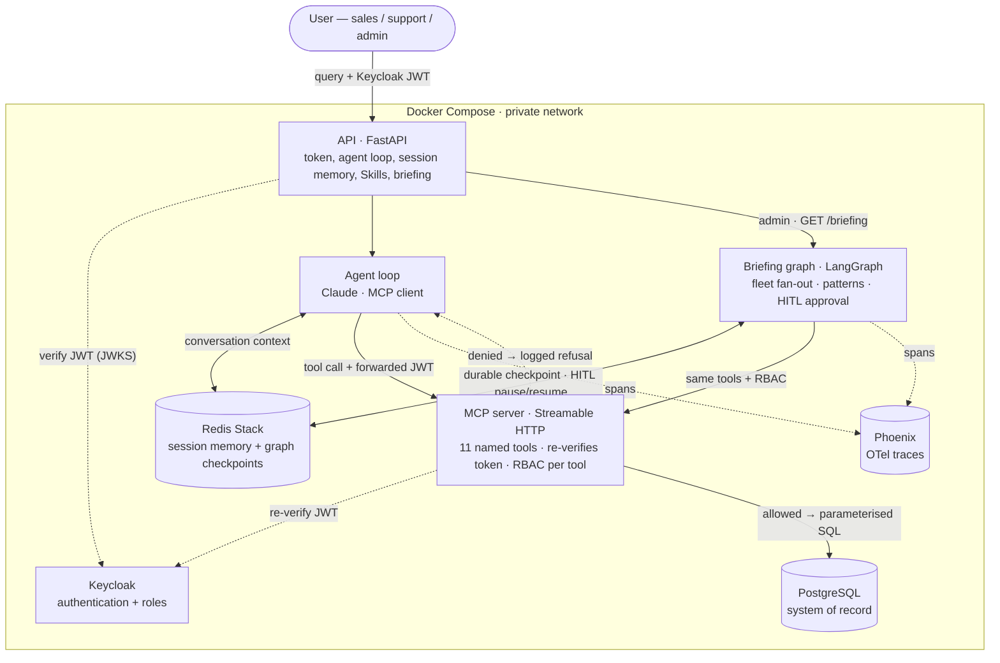

# Vantage

A grounded, **agentic** enterprise assistant for **Acme Operations** (a fictional B2B payments platform) — an internal copilot for sales, support, and operations staff that **retrieves, summarises, and recommends next actions** across customers and their support issues, **securely and auditably**. Built for the EY Applied AI Engineer technical assessment.

The agent reasons over a small set of **named, RBAC-checked tools** exposed by a **custom MCP server**, never raw SQL. Permissions are enforced in the tools (not the prompt), so even a fully prompt-injected agent can't exceed the caller's role. Answers are always grounded in the database — a missing customer is reported as "not found," near-identical names are disambiguated, never invented.

> Design rationale, ADRs, threat model, and the build log live in [`Vantage-vault/`](Vantage-vault/) — start at [`00-NOW.md`](Vantage-vault/00-NOW.md).

## Getting started (5 minutes)

You need **Docker** (Docker Desktop on macOS/Windows, or Docker Engine on Linux) and an **`ANTHROPIC_API_KEY`** — bring your own; the app calls Claude via the Anthropic API. No other prerequisites.

```bash
git clone <this repo>
cd Vantage
cp .env.example .env
# edit .env and set: ANTHROPIC_API_KEY=sk-ant-...
docker compose up --build      # db + redis + keycloak + mcp + api + phoenix
```

First boot takes ~60s (Keycloak imports the realm, Postgres loads the seed). Check readiness: `curl localhost:8000/ready`.

**Open <http://localhost:8000/>** and sign in via Keycloak as one of the three demo personas — they correspond to the three roles in the user stories:

| Role | Username | Password | What they can do |
|---|---|---|---|
| Sales | `priya.nair` | `priya` | read customer profiles + open issues + history |
| Support | `marcus.webb` | `marcus` | reads + `update_issue` (notes / status) |
| Admin | `dana.okafor` | `dana` | reads + writes + `create_next_action` / `update_next_action` |

A good first query to type into the chat as **Marcus**:

> *Show open issues for Velocity Marketplace, summarise the most urgent, and suggest a next action.*

You should see tokens stream in, then click **show thinking** under the answer to see the agent's reasoning interleaved with the tools it called (`get_customer_profile` → `get_open_issues` → `summarise_issue_history`) and per-tool latency. Use **Sign in as another persona** in the bottom-left menu to swap to Priya or Dana — that's a real OIDC re-auth, not a UI flip, so trying an admin-only write as Priya will be **denied at the tool boundary** (the trace shows the deny).

> Prefer zero-install? This repo has a `.devcontainer/` — opening it as a **GitHub Codespace** runs the same `docker compose up` inside a hosted VM (set `ANTHROPIC_API_KEY` as a Codespace secret in repo Settings first).

## Architecture



- **Agent** = a minimal Claude **tool-calling loop**, not a framework ([ADR-001](Vantage-vault/05-Decisions/ADR-001-agent-framework.md)); model-agnostic via `app/llm.py`.
- **MCP server** exposes the eleven named tools over Streamable HTTP ([ADR-003](Vantage-vault/05-Decisions/ADR-003-mcp-server.md)); the agent *discovers* and *calls* them — it never sees SQL and never holds DB credentials.
- **RBAC is enforced inside each tool**, on the Keycloak token **re-verified at the MCP boundary** ([ADR-002](Vantage-vault/05-Decisions/ADR-002-rbac-tool-boundary.md)) — never in the prompt.
- **Postgres** = system of record; **Redis** = ephemeral multi-turn session memory ([ADR-006](Vantage-vault/05-Decisions/ADR-006-memory-split.md)).
- **Proactive briefing** = an admin-only **LangGraph** graph ([ADR-008](Vantage-vault/05-Decisions/ADR-008-langgraph-proactive-path.md)) — the hybrid's *second* execution shape: fleet fan-out → cross-customer patterns → AI-drafted next actions → **human-in-the-loop approval** (durable pause/resume on a Redis checkpointer). The simple loop still serves reactive `/ask`; the graph is used only where its triggers (parallelism + HITL + durable runs) actually fire.
- **Tracing** = OpenTelemetry → self-hosted **Phoenix** (no egress) for both the loop and the graph; **LangSmith** opt-in via a key.

## The eleven tools
Six point-lookup / write tools, three browse/list tools (PR #21), plus two admin-only fleet aggregates that power the proactive briefing ([ADR-008](Vantage-vault/05-Decisions/ADR-008-langgraph-proactive-path.md)).
| Tool | Does | Roles |
|---|---|---|
| `get_customer_profile` | resolve a customer by name (found / ambiguous / not_found) | all |
| `get_open_issues` | a customer's open issues, most-urgent first | all |
| `summarise_issue_history` | an issue + its full audit trail + any next actions | all |
| `update_issue` | add a note / change status (attributable) | support, admin |
| `create_next_action` / `update_next_action` | record/update a formal next action | admin |
| `list_customers` | browse/filter customers (region, segment, tier, account manager); paginated | all |
| `list_issues` | browse/filter issues across customers (status, priority, category); paginated | all |
| `list_next_actions` | browse/filter next actions (overdue, status, customer); paginated | all |
| `get_high_risk_customers` | rank accounts by open critical/high issues (fleet view) | admin |
| `detect_patterns` | cross-customer clusters among open issues ("likely platform") | admin |

A disallowed call writes nothing, returns a structured `denied`, and is **audit-logged**.

## Skills
Reusable, named capabilities (the Anthropic *Agent Skill* pattern, packaged here as JSON): instructions + parameters + an `allowed_tools` whitelist, run through the agent loop. A Skill is *just a prompt + a tool whitelist*, so it can never exceed the caller's permissions.
- Seeded: **Customer Escalation Summary** — risk level + rationale + recommended next action (advice) + missing info; read-only, persists nothing.
- Users can **author their own** by turning a finished session into a skill (`POST /skills/draft-from-session` → review → `POST /skills`).

## Proactive briefing (LangGraph + human-in-the-loop)
The reactive loop answers what a user asks. The **proactive briefing** (`GET /briefing`, admin-only) is the counterpart: one call ranks the high-risk fleet, **composes the escalation-summary skill across every flagged account in parallel**, detects **cross-customer patterns** no per-account view can see, and **drafts a next action per account** — then **pauses for human approval** before anything is written.

This is the one place a simple loop genuinely strains — parallel fan-out, a human-in-the-loop gate, durable pause/resume — so it's built as a **LangGraph graph**, while `/ask` keeps the minimal loop. The decision (and why *not* a rewrite) is [ADR-008](Vantage-vault/05-Decisions/ADR-008-langgraph-proactive-path.md). The graph calls the **same MCP tools across the same RBAC boundary**; the run pauses at an `interrupt()` and resumes on `POST /briefing/{id}/approve`, writing each approved draft via `create_next_action` **with the approving admin's token** — so the approval *is* the authorisation. State is checkpointed in **Redis** (durable across the pause; the API stays free of the system-of-record, [ADR-003](Vantage-vault/05-Decisions/ADR-003-mcp-server.md)). The whole feature sits behind a guarded import — if LangGraph were absent, `/ask` and the UI are entirely unaffected. In the UI it's an admin-only modal that **streams the graph's progress live** (a checklist that lights up node-by-node under an animated brand mark), so the tens-of-seconds run shows real work rather than a blank spinner.

```bash
# as admin (Dana): run the briefing, then approve selected drafts
curl -s localhost:8000/briefing -H "Authorization: Bearer $TOKEN"            # → {briefing_id, drafts[], patterns[], pending_approval:true}
curl -s -X POST localhost:8000/briefing/$ID/approve -H "Authorization: Bearer $TOKEN" \
  -H 'Content-Type: application/json' -d '{"approved_ids":[0]}'              # → writes the approved next action(s)
```

## Chat UI

Single-page chat (Alpine.js + Tailwind Play CDN + markdown-it + DOMPurify, no build step) served by FastAPI at `/`. Streaming SSE token-by-token via `/ask/stream`; per-message **show thinking** panel interleaves the model's pre-tool reasoning with each tool-call pill + per-tool latency; sidebar of past chats (one per OIDC user, Redis-backed); Skills menu; **save as skill** authoring affordance; dark/light themes; full keyboard support (`⌘N` new chat, `⌘K` skills, Enter to send). Each completed answer carries a visible **Sources** footer (the tools + data it drew on) and **role-aware follow-up chips**; **Stop** truly aborts an in-flight response (not just hides the spinner); new chats get a concise **LLM-generated title**; answers and code blocks have **copy** buttons.

## Hit the API directly (without the UI)

Useful for scripting, evals, or sanity-checking the agent loop. The dev-only ROPC password grant gets you a JWT:

```bash
TOKEN=$(curl -s http://localhost:8080/realms/vantage/protocol/openid-connect/token \
  -d grant_type=password -d client_id=vantage-api -d client_secret=vantage-secret \
  -d username=marcus.webb -d password=marcus | python3 -c 'import sys,json;print(json.load(sys.stdin)["access_token"])')

curl -s -X POST http://localhost:8000/ask -H "Authorization: Bearer $TOKEN" \
  -H 'Content-Type: application/json' \
  -d '{"query":"Show open issues for Velocity Marketplace, summarise the most urgent, and suggest a next action."}'
```

The browser flow uses real **OIDC Auth-Code + PKCE + BFF cookie** (the access token never reaches the browser); the password grant above is dev-only.

### Endpoints
- `POST /ask` `{query, session_id?}` — non-streaming; returns `{answer, trace, elapsed_ms, session_id}`. Used by the eval harness for deterministic assertions.
- `POST /ask/stream` `{query, session_id?}` — Server-Sent Events: `session` → `text` (deltas) → `tool_start` → `tool_end` → `done`. The UI surface.
- `GET /sessions` · `GET /sessions/{id}` · `DELETE /sessions/{id}` — the calling user's chat history.
- `POST /sessions/{id}/title` `{query, answer}` — generate + persist a concise LLM chat title (sidebar).
- `POST /followups` `{query, answer}` — up to 3 role-aware follow-up suggestions for the last exchange.
- `GET /skills` · `POST /skills/{name}/run` `{params}` — list / invoke Skills.
- `POST /skills/draft-from-session` · `POST /skills` — author a Skill from a session, then save.
- `GET /briefing` — **admin-only** proactive fleet briefing; runs the LangGraph graph to the approval gate and returns `{briefing_id, summaries, patterns, drafts, pending_approval}`.
- `GET /briefing/stream` — **admin-only** SSE variant of `GET /briefing`: a `step` event per graph node as it completes (`plan` → per-account `summarise_one` → `detect` → `draft`), then `done` with the drafts. Drives the UI's live progress so a tens-of-seconds run never looks frozen.
- `POST /briefing/{id}/approve` `{approved_ids}` — **admin-only**; resume the paused briefing and write the approved next actions (the approver's token authorises each write). `404` if the briefing is unknown/expired.
- `GET /auth/login` · `GET /auth/callback` · `GET /auth/logout` · `GET /auth/switch?username=<persona>` · `GET /auth/whoami` — the BFF auth surface.
- `GET /health` · `GET /ready`.

## Security
JWT fully verified (signature/issuer/expiry, `alg` pinned); RBAC at the tool boundary, re-verified by the MCP server; parameterised SQL only (no raw-SQL tool); audit logs record identifiers + actions, never tokens or PII. Threat model + dev→prod hardening: [`09-Security.md`](Vantage-vault/09-Security.md).

## Observability
Every `/ask` returns a `trace` of tool calls (input, result status, per-tool `ms`) + total `elapsed_ms`; write attempts emit a server-side **audit log** line (`user / roles / target / decision`); tool/agent errors surface as a `502` on `/ask` or a streamed `error` event on `/ask/stream`, with a **generic** message — internals are logged server-side, never returned to the client.

On top of that, **OpenTelemetry tracing** exports spans to a self-hosted **Arize Phoenix** service (UI at `localhost:6006`) — OpenInference auto-instruments the OpenAI SDK (every model call in the loop *and* the briefing) and LangChain/LangGraph (the briefing graph's nodes, so the parallel fan-out and the approval gate are visible as a span tree). Nothing leaves the host; **LangSmith** is wired as an opt-in second backend that activates only when `LANGSMITH_API_KEY` is set (the stated bonus tracing — [ADR-008](Vantage-vault/05-Decisions/ADR-008-langgraph-proactive-path.md)).

## Evaluation
13 acceptance cases (tool-selection, grounding E1/E2/E3, RBAC allow+deny, multi-turn memory, the Skill, browse tools, auth), a 30-case adversarial **robustness** suite, and an 11-check **briefing** suite (admin-only RBAC, grounded drafts, the HITL approval gate, approve→write) — see [`07-Evals.md`](Vantage-vault/07-Evals.md). Run against the live stack:
```bash
python eval/run_evals.py        # 13/13 — acceptance
python eval/run_robustness.py   # 30/30 — adversarial / edge cases
python eval/run_briefing.py     # 11/11 — the proactive briefing (ADR-008)
```

## Repo layout
- `app/` — FastAPI API, agent loop (MCP client), session memory, Skills, the briefing graph (`briefing_graph.py`), tracing (`telemetry.py`)
- `mcp_server/` — the MCP server: the eleven tools, DB access, token re-verification
- `db/` — `schema.sql` + `seed.sql` (committed; generator in `scripts/`)
- `keycloak/` — realm config (roles + dev users)
- `eval/` — evaluation harness
- `Vantage-vault/` — design vault (ADRs, architecture, user stories, security, build log)

## AI-usage notes
This project was built with heavy AI assistance under human review; each delegated task and how it was validated is logged in [`06-Build-Log.md`](Vantage-vault/06-Build-Log.md#ai-usage-log).
