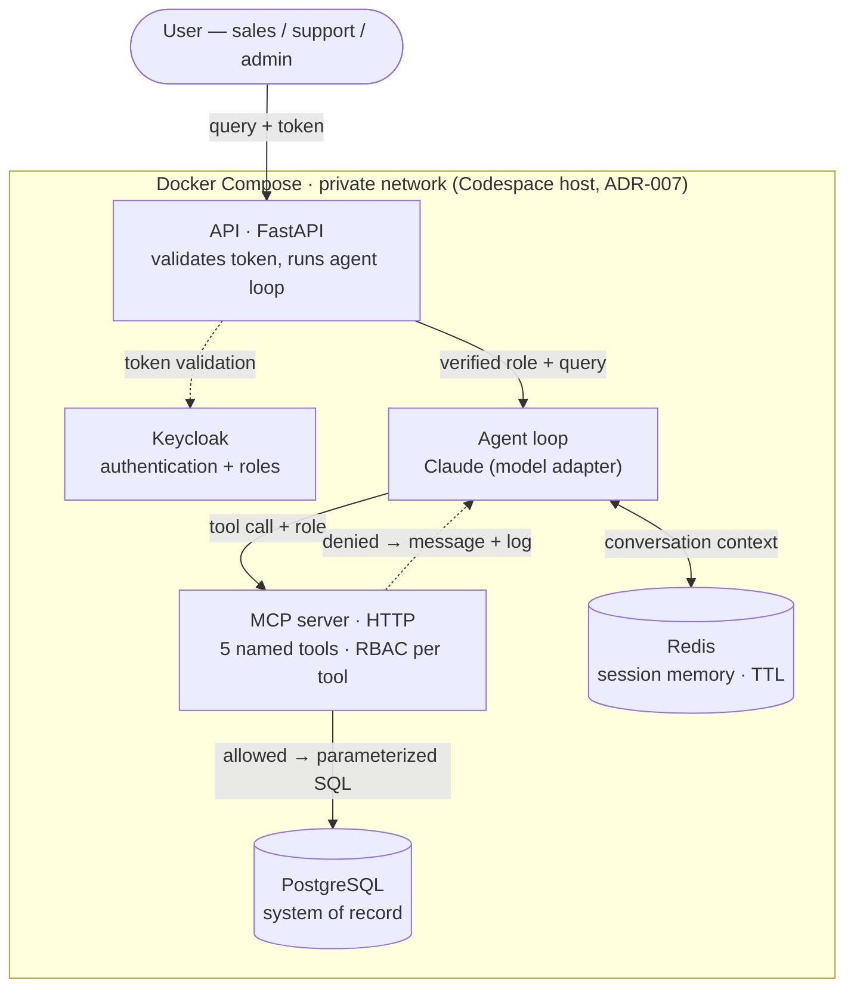

# Architecture

> [!NOTE] Purpose
> The design that serves the stories and scope. Each non-obvious choice has an ADR in [05-Decisions](05-Decisions/). Feeds the README + the architecture diagram (Deliverable 3). **Design locked; the diagram is rendered during the build.**

## Decisions locked
- **[ADR-001](05-Decisions/ADR-001-agent-framework.md)** — agent = simple tool-calling loop (not LangGraph); model-agnostic; built for a contained LangGraph migration.
- **[ADR-002](05-Decisions/ADR-002-rbac-tool-boundary.md)** — RBAC enforced server-side in each tool (never in the prompt); Keycloak is the source of truth for roles.
- **[ADR-003](05-Decisions/ADR-003-mcp-server.md)** — custom MCP server exposing the 5 named tools; HTTP transport (stdio fallback).
- **[ADR-004](05-Decisions/ADR-004-environment.md)** — *(superseded)* Azure VM was the original plan; SKU-locked.
- **[ADR-005](05-Decisions/ADR-005-seed-data.md)** — committed static seed, generated hybrid (Faker + Claude), shaped to the evals.
- **[ADR-006](05-Decisions/ADR-006-memory-split.md)** — Redis for session/working memory; PostgreSQL as the system of record.
- **[ADR-007](05-Decisions/ADR-007-environment-codespaces.md)** — dev/demo host is **GitHub Codespaces** (Docker-in-Docker) running the portable compose stack.

## Component map (Docker Compose services)
- **App / API** — entry point (FastAPI assumed); validates the Keycloak token, runs the agent loop.
- **Agent loop** — gives Claude (via a thin, swappable model adapter) the tool list; executes chosen tools; returns the answer.
- **MCP server** — exposes the 5 named tools over HTTP; each tool checks role, then queries Postgres.
- **PostgreSQL** — durable store.
- **Redis** — multi-turn session memory.
- **Keycloak** — authentication + role issuance.

*All on the host's private Docker network ([ADR-007](05-Decisions/ADR-007-environment-codespaces.md): GitHub Codespaces with Docker-in-Docker); MCP HTTP is container-to-container, not internet-exposed. The forwarded Keycloak JWT is **re-verified at the MCP boundary** (ADR-002/003), so each tool checks RBAC on a token it has just validated.*

## The agent
Minimal single-agent tool-calling loop (ADR-001): question → Claude selects tool(s) → tool runs (RBAC-checked) → result → repeat → answer. The model call sits behind a thin adapter for provider-agnosticism.

## Tools (the five)
`get_customer_profile` · `get_open_issues` · `summarise_issue_history` · `update_issue` · `create`/`update_next_action`. Standalone, typed functions; each enforces RBAC (ADR-002) and uses parameterized SQL (no raw SQL exposed). Exposed via the MCP server (ADR-003).

## Skills (reusable, named capabilities)
A **Skill** is a packaged, reusable capability — the Anthropic Agent-Skill pattern, embodied here as a small JSON file: `{name, description, instructions, parameters[], allowed_tools[]}`. Running a Skill *reuses the agent loop*: the skill's instructions become the system prompt and `allowed_tools` restricts the toolset — **least privilege on top of** the per-tool RBAC. A Skill is *just a prompt + a tool whitelist*, so even a user-authored skill can never exceed the caller's permissions (the dividend of keeping RBAC in the tools, not the prompt).

- **Seeded:** `escalation-summary` (story S2) — read-only, persists nothing; encodes the risk rubric below.
- **Users can author their own** by turning a finished `/ask` session into a Skill (the LLM generalises the conversation; `allowed_tools` = the tools the session actually used). Seeded skills are committed in the image; authored skills live on a writable volume.
- Endpoints: `GET /skills`, `POST /skills/{name}/run`, `POST /skills/draft-from-session`, `POST /skills` (save).

## Where RBAC is enforced
Server-side, inside each tool (ADR-002). Keycloak issues a token carrying the user's role; the verified role is threaded to the tool; the tool checks before acting. *The LLM proposes; the tool disposes.*

## Data model
Standard ticketing model (validated against canonical support-system schemas). Five tables:

- **`customers`** — `id` · `name` · `account_ref` (unique, human-facing) · `region`/`postcode` · `segment` · `tier` · `account_manager_id`→users · `created_at`. *(`account_ref` + `region` enable disambiguation — edge case E2.)*
- **`issues`** — `id` · `customer_id`→customers · `title` · `description` · `category` (see below) · `status` (open / in_progress / pending / resolved / closed) · `priority` (low / medium / high / critical) · `assigned_to`→users · `created_at` · `updated_at`. *("Open" = status ∈ {open, in_progress, pending}.)*
- **`issue_updates`** (history / audit trail) — `id` · `issue_id`→issues · `author_id`→users · `body` · `update_type` (note / status_change) · `created_at`.
- **`next_actions`** (admin-owned) — `id` · `issue_id`→issues · `created_by_id`→users · `description` · `due_date` · `status` (open / done / cancelled) · `created_at` · `updated_at`.
- **`users`** — `id` · `keycloak_id` · `display_name` · `email` · `role` · `created_at`. *(`role` mirrors Keycloak; enforcement reads the token — ADR-002.)*

**Relationships:** customer 1—* issues; issue 1—* issue_updates; issue 1—* next_actions; user 1—* issue_updates / next_actions (attribution); customer *—1 user (account manager).
**Indexes:** `issues.customer_id`, `issues.status`, and the foreign keys (hot query paths).

### Domain: issue categories & what "risk" means (payments platform)
Drives the seed data (ADR-005) and the Escalation Summary Skill's risk level.
- **Categories:** `integration` (webhook/API errors), `payments` (failed payouts, disputes), `onboarding/compliance` (KYC holds), `billing` (invoice disputes), `access` (SSO/API keys), `performance`.
- **Risk → High/Critical:** open KYC/compliance hold blocking go-live · repeated payout failures · multiple high/critical open issues · a critical integration down · long-unresolved issues · renewal near with unresolved issues. **Low:** few/no open issues, all low priority.

## Memory split (Redis vs PostgreSQL)
See [ADR-006](05-Decisions/ADR-006-memory-split.md).
- **Redis — ephemeral session/working memory:** multi-turn conversation history + recent tool outputs, keyed `session:{id}` with a ~1h TTL (rolling buffer within token budget). *(Could: cache-aside for customer lookups.)*
- **PostgreSQL — durable system of record:** `customers`, `issues`, `issue_updates`, `next_actions`, `users`.
- **Rule:** never the system of record in Redis; a Redis wipe loses only in-flight context, never business data.

## Diagram
Mermaid — renders in both Obsidian and on GitHub (portable; lift into the README at submission).

*Flow: user sends query + Keycloak token → API validates it and gates the request → the agent (an MCP client) **forwards the token** to the MCP server → MCP **re-verifies it** and each tool checks the role, then runs parameterized SQL against Postgres (or returns a logged denial). Session context lives in Redis. Everything runs inside the host's private Docker network ([ADR-007](05-Decisions/ADR-007-environment-codespaces.md): GitHub Codespaces).*
